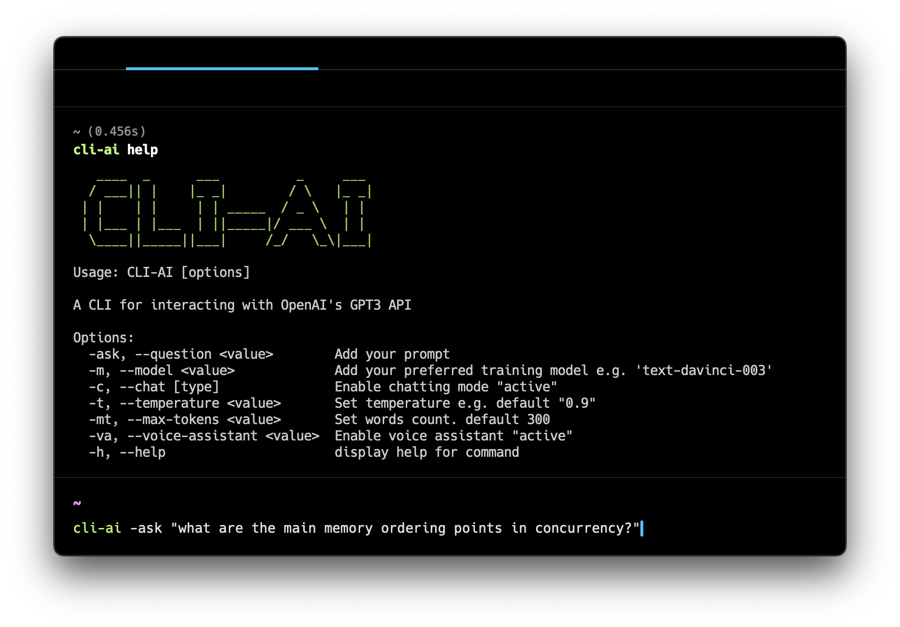

<div align="center">
   

   <h3>Cli-AI</h3>
   <p align="center">
   A command line interface client for interacting with OpenAI's GPT3
   </p>
   <div style="">
      
      <span class="badge-npmversion"><a href="https://npmjs.org/package/cli-ai" title="View this project on NPM"></a></span>
      
      
      
   </div>
      
</div>


---

 <br />


## ✨ Introduction
`Cli-AI` is a simple and easy to use tool that allows you to interact with OpenAI's GPT3 from your terminal.

 <br />


## Installation

##### NPM
```bash
npm install -g cli-ai
```
##### Yarn
```bash
yarn global add cli-ai
```

<br />


## Setup

#### Linux/MacOS

To use `cli-ai` you need to have an OpenAI API key. You can get one [here](https://beta.openai.com/account/api-keys). This is how you can set it up in `zsh`, `bash` shells

**zsh**
To Setup the keu replace `YOUR_KEY_GOES_HERE` with your OpenAI API key which you can get from [here](https://beta.openai.com/account/api-keys) and run this command in your terminal
```bash
echo "export OPENAI_API_KEY='YOUR_KEY_GOES_HERE'" >> ~/.zshrc
```

Update the state of your shell with the newly added variable:
```bash
source ~/.zshrc
```
Verify that the environment variable has been set correctly:
```bash
echo $OPENAI_API_KEY
```

**Bash**
Same as zsh but replace `~/.zshrc` with `~/.bashrc`
```bash
# Set your API key
echo "export OPENAI_API_KEY='YOUR_KEY_GOES_HERE'" >> ~/.bashrc
# Update the state of your shell with the newly added variable
source ~/.bashrc
# Confirm that you have set your environment variable
echo $OPENAI_API_KEY
```

<br/>

## Usage
CLI-AI Commands are very simple and easy to use. Here's a list of the available commands

##### Get a list of all available commands
```bash
cli-ai --help
```
##### Ask your question to GPT3
```bash
cli-ai -ask "What is the meaning of life?"
```

##### Increase character limit
```bash
cli-ai -ask "What is the meaning of life?" --max-tokens 300
cli-ai -ask "What is the meaning of life?" -mt 300
```
<small>Tokens are pieces of words. 1,000 tokens are about 750 words. [OpenAI](https://openai.com/api/pricing/)</small>

##### Enable Voice Assistant
```bash
cli-ai -ask "What is the meaning of life?" -mt 300 --voice-assistant "active"
cli-ai -ask "What is the meaning of life?" -mt 300 -vt "active"
```

<br/>

 ## License
This project is licensed under the BSD 3-Clause License - see the [LICENSE](LICENSE) file for details

---
> Github [@humamaboalraja](https://github.com/humamaboalraja) &nbsp;&middot;&nbsp; Twitter [@humamaboalraja](https://twitter.com/humamaboalraja)